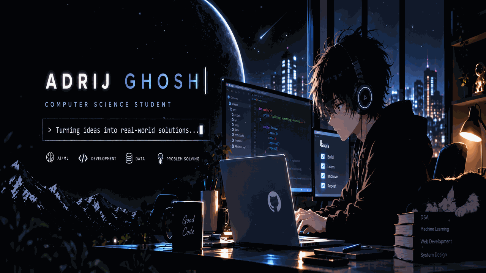

<div align="center">



<br>


<br><br>

<a href="https://linkedin.com/in/adrij-ghosh-089886360/">
  
</a>
<a href="https://leetcode.com/u/Adrij1041/">
  
</a>

</div>

---

## 👋 About Me

I'm a **Computer Science student** interested in building practical software with **AI/ML, backend development and problem solving**.

I enjoy taking an idea from a dataset or algorithm and turning it into something that people can actually use.

```text
Build → Learn → Improve → Repeat
```

---

## 🧠 What I Work With

<div align="center">

### Languages


### AI / ML & Data


### Backend & Database


### Frontend & Tools


</div>

---

## 🚀 Featured Projects

### 🧬 GeneCare AI
AI-powered disease prediction and anomaly detection platform.

- Machine learning prediction pipelines
- FastAPI backend
- SHAP-based model explanations
- React frontend
- Authentication and prediction history

**Repository:**  
→ https://github.com/adrijghosh8/genecare_ai

---

### 📄 AI Resume Checker
A resume matching system that combines **NLP, TF-IDF and skill-based matching** to compare resumes with job requirements.

**Focus:** NLP • Skill Extraction • Similarity • Backend APIs

---

### 🔎 Anomaly Detection Research
A research-oriented anomaly detection project exploring machine learning and unsupervised techniques for identifying unusual patterns in large datasets.

**Focus:** Anomaly Detection • Clustering • Explainability • Research

---

## ⚡ Current Focus


## LeetCode

<div align="center">

<a href="https://leetcode.com/u/Adrij1041/">
  
</a>

</div>

<div align="center">

### `Think • Build • Solve • Repeat`


</div>
